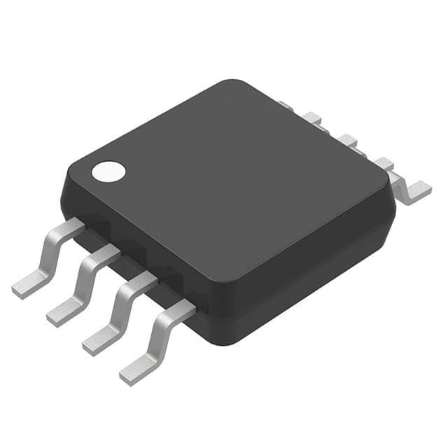
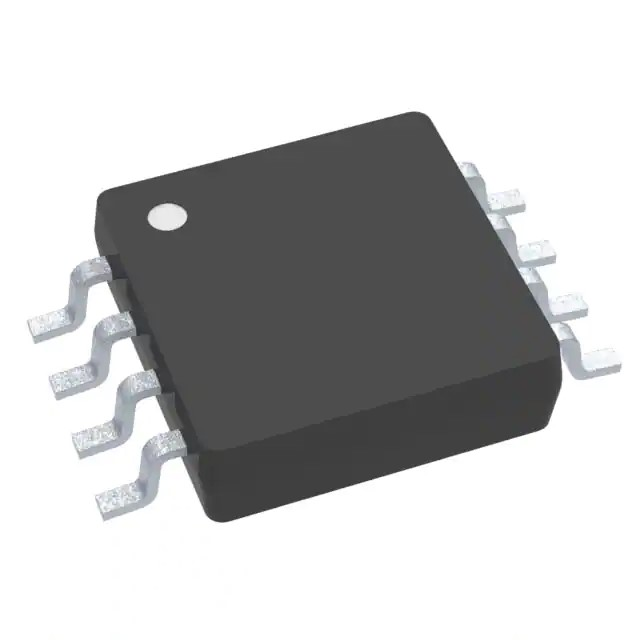
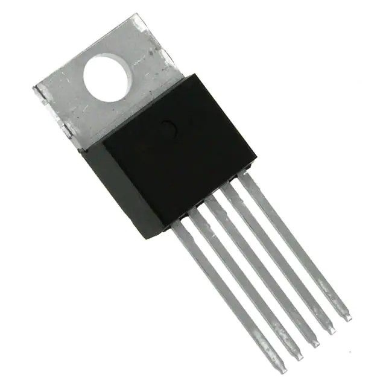

> **Component Selection**
>
> **Team 204**

**Professor Aukes**

# Richard Green, Eduardo Lopez Sensor

<table>
<colgroup>
<col style="width: 36%" />
<col style="width: 8%" />
<col style="width: 22%" />
<col style="width: 8%" />
<col style="width: 23%" />
</colgroup>
<thead>
<tr class="header">
<th><blockquote>

<strong>Solution</strong>

</blockquote></th>
<th></th>
<th><blockquote>

<strong>Pros</strong>

</blockquote></th>
<th></th>
<th><blockquote>

<strong>Cons</strong>

</blockquote></th>
</tr>
</thead>
<tbody>
<tr class="odd">
<td><blockquote>

<strong>Option 1</strong>

<strong>PN/Description:</strong> ADT7461AARMZ-R

temperature sensor

<strong>Price:</strong> $6.34/each

<a href="https://www.digikey.com/en/products/detail/onsemi/ADT7461AARMZ-R/4331858?utm_adgroup=General&amp;utm_source=google&amp;utm_medium=cpc&amp;utm_campaign=Shopping_Supplier_onsemi&amp;utm_term=&amp;utm_content=General&amp;gclid=CjwKCAjw-L-ZBhB4EiwA76YzOXnLAAnEeAZJPqSmXkHQgMB5LMlTJL6IoIm7UB0qioisiruFj0UARBoCiNoQAvD_BwE"><u>LINK</u></a>

</blockquote></td>
<td><blockquote>

●

●

●

</blockquote></td>
<td>
3.3V output voltage

Surface mount

Follows project requirements
</td>
<td><blockquote>

●

●

</blockquote></td>
<td>Double the price of similar components Longer lead time</td>
</tr>
<tr class="even">
<td><blockquote>

<strong>Option 2</strong>

<strong>PN/Description:</strong>

LM90CIMM/NOPB

Temperature sensor

Price: $3.23

<a href="https://www.digikey.com/en/products/detail/texas-instruments/LM90CIMM-NOPB/483108"><u>LINK</u></a>

</blockquote></td>
<td><blockquote>

●

●

●

●

</blockquote></td>
<td>
Inexpensive

3.3V output voltage

Surface mount Meets project requirements
</td>
<td><blockquote>

●

●

</blockquote></td>
<td>
Never used before

Long lead time
</td>
</tr>
<tr class="odd">
<td><blockquote>

<strong>Option 3</strong>

</blockquote></td>
<td><blockquote>

●

●

●

</blockquote></td>
<td>inexpensive Senses temperature Goos supply voltage</td>
<td><blockquote>

●

●

</blockquote></td>
<td>Through hole Does not meet project requirements</td>
</tr>
<tr class="even">
<td><blockquote>

</blockquote>

<strong>PN/Description:</strong>

TC74A4-3.3V Temperature sensor

<strong>Price:</strong> $1.09/each

<a href="https://www.digikey.com/en/products/detail/microchip-technology/TC74A0-5-0VAT/442721"><u>LINK</u></a>
</td>
<td colspan="2"></td>
<td colspan="2"></td>
</tr>
</tbody>
</table>

# Choice: Option 3, TC74A4-3.3V

**Rationale:** Option 3 seems to align with our project needs because it is an inexpensive component that will sense temperature using 3.3V and through hole mounting. We chose this option because it is similar to other components but cheaper and is used in class making it readily available.

