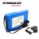

> **Component Selection**
>
> **Team 204**

**Professor Aukes**

# Nicholas Dunn, Richard Green, Eduardo Lopez Sensor

<table>
<colgroup>
<col style="width: 36%" />
<col style="width: 8%" />
<col style="width: 22%" />
<col style="width: 8%" />
<col style="width: 23%" />
</colgroup>
<thead>
<tr class="header">
<th><blockquote>

<strong>Solution</strong>

</blockquote></th>
<th></th>
<th><blockquote>

<strong>Pros</strong>

</blockquote></th>
<th></th>
<th><blockquote>

<strong>Cons</strong>

</blockquote></th>
</tr>
</thead>
<tbody>
<tr class="odd">
<td><blockquote>

<strong>Option 1</strong>

<strong>PN/Description:</strong> ADT7461AARMZ-R

temperature sensor

<strong>Price:</strong> $6.34/each

<a href="https://www.digikey.com/en/products/detail/onsemi/ADT7461AARMZ-R/4331858?utm_adgroup=General&amp;utm_source=google&amp;utm_medium=cpc&amp;utm_campaign=Shopping_Supplier_onsemi&amp;utm_term=&amp;utm_content=General&amp;gclid=CjwKCAjw-L-ZBhB4EiwA76YzOXnLAAnEeAZJPqSmXkHQgMB5LMlTJL6IoIm7UB0qioisiruFj0UARBoCiNoQAvD_BwE"><u>LINK</u></a>

</blockquote></td>
<td><blockquote>

●

●

●

</blockquote></td>
<td>
3.3V output voltage

Surface mount

Follows project requirements
</td>
<td><blockquote>

●

●

</blockquote></td>
<td>Double the price of similar components Longer lead time</td>
</tr>
<tr class="even">
<td><blockquote>

<strong>Option 2</strong>

<strong>PN/Description:</strong>

LM90CIMM/NOPB

Temperature sensor

Price: $3.23

<a href="https://www.digikey.com/en/products/detail/texas-instruments/LM90CIMM-NOPB/483108"><u>LINK</u></a>

</blockquote></td>
<td><blockquote>

●

●

●

●

</blockquote></td>
<td>
Inexpensive

3.3V output voltage

Surface mount Meets project requirements
</td>
<td><blockquote>

●

●

</blockquote></td>
<td>
Never used before

Long lead time
</td>
</tr>
<tr class="odd">
<td><blockquote>

<strong>Option 3</strong>

</blockquote></td>
<td><blockquote>

●

●

●

</blockquote></td>
<td>inexpensive Senses temperature Goos supply voltage</td>
<td><blockquote>

●

●

</blockquote></td>
<td>Through hole Does not meet project requirements</td>
</tr>
<tr class="even">
<td><blockquote>

</blockquote>

<strong>PN/Description:</strong>

TC74A0-5.0VAT temperature sensor

<strong>Price:</strong> $1.73/each

<a href="https://www.digikey.com/en/products/detail/microchip-technology/TC74A0-5-0VAT/442721"><u>LINK</u></a>
</td>
<td colspan="2"></td>
<td colspan="2"></td>
</tr>
</tbody>
</table>

# Choice: Option 2, LM90CIMM/NOPB

**Rationale:** Option 2 seems to align with our project needs because it is an inexpensive component that will sense temperature using 3.3V and through hole mounting. We chose this option because it is similar to other components but cheaper and will get delivered faster as well.

**<u>Motor Driver</u>**

<table>
<colgroup>
<col style="width: 36%" />
<col style="width: 8%" />
<col style="width: 22%" />
<col style="width: 8%" />
<col style="width: 23%" />
</colgroup>
<thead>
<tr class="header">
<th><blockquote>

<strong>Solution</strong>

</blockquote></th>
<th></th>
<th><blockquote>

<strong>Pros</strong>

</blockquote></th>
<th></th>
<th><blockquote>

<strong>Cons</strong>

</blockquote></th>
</tr>
</thead>
<tbody>
<tr class="odd">
<td><blockquote>

<strong>Option 1: L293DD</strong>

<strong>Description:</strong>

Push-Pull Four Channel

Drivers SMD SOP-20

</blockquote></td>
<td><blockquote>

●

●

</blockquote></td>
<td>Surface mount chip Ideal for our motor designs.</td>
<td><blockquote>

●

</blockquote></td>
<td>From ebay, so not only would it be unreliable to ship, but also unreliable or it to work.</td>
</tr>
<tr class="even">
<td><strong><u><a href="https://www.ebay.com/itm/191757085300?chn=ps&amp;mkevt=1&amp;mkcid=28">Link</a></u> $1.88</strong></td>
<td></td>
<td></td>
<td></td>
<td></td>
</tr>
<tr class="odd">
<td><blockquote>

<strong>Option 2: TC664EUNTR</strong>

<strong>Description</strong>:

IC MOTOR DRIVER 3V-5.5V

10MSOP

</blockquote>

<u><a href="https://www.digikey.com/en/products/detail/microchip-technology/TC664EUNTR/509516">Link</a></u> $2.36
</td>
<td><blockquote>

●

●

●

</blockquote></td>
<td>I2C compatible Surface Mount</td>
<td><blockquote>

●

●

</blockquote></td>
<td>
Small

Lead times high
</td>
</tr>
<tr class="even">
<td><blockquote>

<strong>Option 3: DRV2605LDGST</strong>

<strong>Description:</strong>

IC motor driver 2V-5.5V

10VSSOP

</blockquote>

<a href="https://www.digikey.com/en/products/detail/texas-instruments/DRV2605LDGST/5023854">Link</a> $3.16
</td>
<td><blockquote>

●

●

●

</blockquote></td>
<td>
Surface mount

I2C compatible

Small lead time
</td>
<td><blockquote>

●

●

</blockquote></td>
<td>More expensive</td>
</tr>
</tbody>
</table>

# Choice: DRV2605LDGST

**Rationale:** Because of the wait time on the second option, I believe the third choice to be the best decision. Primarily because of the wait times on option 2, spending a little bit more would ensure we get the part before we need it. Option 1 is a poor choice because of the vendor, Ebay. It would be unreliable, so option 3 would be the safest course of action.

**<u>Motor</u>**

<table>
<colgroup>
<col style="width: 36%" />
<col style="width: 8%" />
<col style="width: 22%" />
<col style="width: 7%" />
<col style="width: 24%" />
</colgroup>
<thead>
<tr class="header">
<th><blockquote>

<strong>Solution</strong>

</blockquote></th>
<th></th>
<th><blockquote>

<strong>Pros</strong>

</blockquote></th>
<th></th>
<th><blockquote>

<strong>Cons</strong>

</blockquote></th>
</tr>
</thead>
<tbody>
<tr class="odd">
<td><blockquote>

<strong>Option 1: 6 Set DC Motor Kit</strong>

<strong>Description:</strong>

6 Set DC Motors Kit, Mini

Electric Hobby Motor 3V -12V

</blockquote>

25000 RPM Strong Magnetic with Shaft Propeller, 2 x AA

<blockquote>

Battery Holder,9V Battery Clip

Connector,Plastic Wheels for DIY Science Project

</blockquote>

<strong><u><a href="https://www.amazon.com/EUDAX-Electric-Magnetic-Propeller-Connector/dp/B08GPPJR1T/ref=sr_1_1_sspa?crid=2CEFWBM90ZG45&amp;keywords=DC+motor&amp;qid=1675266955&amp;sprefix=dc+motor%2Caps%2C128&amp;sr=8-1-spons&amp;psc=1&amp;smid=A27JQP2WM1GK86&amp;spLa=ZW5jcnlwdGVkUXVhbGlmaWVyPUEyVE9LVTZMRFRKOUo3JmVuY3J5cHRlZElkPUEwNzg3MDA2MkZGQkpMUzFUSEUzOCZlbmNyeXB0ZWRBZElkPUEwOTYwMjYwNzg4WU9WUDA0RlRHJndpZGdldE5hbWU9c3BfYXRmJmFjdGlvbj1jbGlja1JlZGlyZWN0JmRvTm90TG9nQ2xpY2s9dHJ1ZQ==">Link</a></u> $11.99</strong>
</td>
<td><blockquote>

●

●

●

</blockquote></td>
<td>
Includes compatible motors for the entire team. Includes motor components, such as wire.

Includes fan blades, another component for our project.
</td>
<td><blockquote>

●

●

●

</blockquote></td>
<td>
Smaller motors. ATtachment may be difficult.

Many unnecessary components.
</td>
</tr>
<tr class="even">
<td><blockquote>

<strong>Option 2: Topoox 6 Pack</strong>

<strong>Description:</strong>

Topoox 6 Pack DC 1.5-3V

</blockquote>

15000RPM Mini Electric Motor for DIY Toys, Science

<blockquote>

Experiments

</blockquote></td>
<td><blockquote>

●

●

●

</blockquote></td>
<td>
Motors are compatible with our controller.

Many, so each member has one. Easy access pins for soldering.
</td>
<td><blockquote>

●

●

</blockquote></td>
<td>Smaller motors mean its harder to attach. Axle has no notches, attachments are difficult.</td>
</tr>
<tr class="odd">
<td><strong><u><a href="https://www.amazon.com/Topoox-15000-16500RPM-Electric-Science-Experiments/dp/B073Q2Y3RC/ref=sr_1_8?crid=2CEFWBM90ZG45&amp;keywords=DC+motor&amp;qid=1675266955&amp;sprefix=dc+motor%2Caps%2C128&amp;sr=8-8">Link</a></u> $6.99</strong></td>
<td></td>
<td></td>
<td></td>
<td></td>
</tr>
<tr class="even">
<td><blockquote>

<strong>Option 3:</strong> Greartisan DC 12V

<strong>Description:</strong>

Greartisan DC 12V 550RPM

Gear Motor High Torque Electric Micro Speed

Reduction Geared Motor

</blockquote>

Centric Output Shaft 37mm Diameter Gearbox

<strong><u><a href="https://www.amazon.com/Greartisan-Electric-Reduction-Centric-Diameter/dp/B072R5G5GR/ref=sr_1_9?crid=2CEFWBM90ZG45&amp;keywords=DC%2Bmotor&amp;qid=1675266955&amp;sprefix=dc%2Bmotor%2Caps%2C128&amp;sr=8-9&amp;th=1">Link</a></u> $14.99</strong>
</td>
<td><blockquote>

●

●

</blockquote></td>
<td>Powerful motor. Within power regulation</td>
<td><blockquote>

●

●

●

</blockquote></td>
<td>
Expensive.

Only 1 per order, so limited.

Huge, too large for our needs.
</td>
</tr>
</tbody>
</table>

# Choice: Option 1, 6 DC motor kit

**Rationale:** Due to the nature of our project, we require multiple items to complete the project. These include fan blades, motors, wires, mounting brackets and more. This kit provides not only these items, but enough for every member of our group. The motors themselves are compatible with the prior selected motor controller, so there should be no issues while using this item.

# Wind Speed Sensor

<table>
<colgroup>
<col style="width: 36%" />
<col style="width: 8%" />
<col style="width: 22%" />
<col style="width: 8%" />
<col style="width: 23%" />
</colgroup>
<thead>
<tr class="header">
<th><blockquote>

<strong>Solution</strong>

</blockquote></th>
<th></th>
<th><blockquote>

<strong>Pros</strong>

</blockquote></th>
<th></th>
<th><blockquote>

<strong>Cons</strong>

</blockquote></th>
</tr>
</thead>
<tbody>
<tr class="odd">
<td><blockquote>

<strong>Option 1</strong>

</blockquote></td>
<td><blockquote>

●

●

</blockquote></td>
<td>
Can wire to USB

Most affordable
</td>
<td><blockquote>

●

●

</blockquote></td>
<td>
Open leads

Limited durability, compared to more high end options
</td>
</tr>
<tr class="even">
<td><blockquote>

<strong>PN/Description:</strong>

</blockquote>

1733 ANEMOMETER WIND SENSOR ANLG VOUT

<blockquote>

<strong>Price:</strong> $44.95/each

<a href="https://www.digikey.com/en/products/detail/adafruit-industries-llc/1733/5356813"><u>LINK</u></a>

</blockquote></td>
<td><blockquote>

●

●

</blockquote></td>
<td>Serial communication Easy to use</td>
<td><blockquote>

●

</blockquote></td>
<td>
Inaccurate readings

at higher wind speeds
</td>
</tr>
<tr class="odd">
<td><blockquote>

<strong>Option 2</strong>

<strong>PN/Description:</strong> PCE-ADL 11

Anemometer For Measuring

Wind Speed/Direction

<strong>Price:</strong> $237.00/each

<a href="https://www.digikey.com/en/products/detail/pce-instruments/PCE-ADL-11/15667474"><u>LINK</u></a>

</blockquote></td>
<td><blockquote>

●

●

●

</blockquote></td>
<td>
USB connection

LCD screen for display

Built in temperature sensor
</td>
<td></td>
<td><ul>
<li>
Expensive
</li>
<li>
Does no measure wind
</li>
</ul>
<blockquote>

direction

</blockquote>
<ul>
<li>
Limited accuracy
</li>
</ul></td>
</tr>
<tr class="even">
<td><blockquote>

<strong>Option 3</strong>

<strong>PN/Description:</strong> EV2MO-25

ELECTRONIC WIND VANE

<strong>Price:</strong> $162.00/each

<a href="https://www.digikey.com/en/products/detail/northwest-scada/EV2MO-25/16615614"><u>LINK</u></a>

</blockquote></td>
<td><blockquote>

●

●

●

</blockquote></td>
<td>
Durable build

Serial

communication

Built in temperature sensor
</td>
<td><blockquote>

●

●

●

</blockquote></td>
<td>
Expensive

No datasheet

Limited range of wind detection
</td>
</tr>
</tbody>
</table>

**Choice: 1733 Adafruit Anemometer Wind Sensor Rationale:** The sensor uses a standard I2C interface, making it compatible with a wide range of microcontrollers. It is relatively affordable compared to some other wind sensors, making it a cost-effective option for those who are restricted by a budget.

comes with documentation and examples, making it easier to use and integrate into our project.

# Battery

<table>
<colgroup>
<col style="width: 36%" />
<col style="width: 8%" />
<col style="width: 22%" />
<col style="width: 8%" />
<col style="width: 23%" />
</colgroup>
<thead>
<tr class="header">
<th><blockquote>

<strong>Solution</strong>

</blockquote></th>
<th></th>
<th><blockquote>

<strong>Pros</strong>

</blockquote></th>
<th></th>
<th><blockquote>

<strong>Cons</strong>

</blockquote></th>
</tr>
</thead>
<tbody>
<tr class="odd">
<td><blockquote>

L522 Battery Lithium 9V

Price: $21.94

<a href="https://www.digikey.com/en/products/detail/energizer-battery-company/L522/6009066"><u>L522 Energizer Battery</u></a>

</blockquote></td>
<td><blockquote>

●

●

●

</blockquote></td>
<td>
In stock

Compact size Only needs a simple add on to connect to circuit
</td>
<td><blockquote>

●

●

</blockquote></td>
<td>
Expensive

Components may

require higher voltage
</td>
</tr>
<tr class="even">
<td><blockquote>

12 Volt - 0.8 Ah - UB1208 -

AGM Battery

</blockquote></td>
<td><blockquote>

●

●

●

●

</blockquote></td>
<td>
Easy connection

jack Inexpensive

In stock

Meets component voltage demand
</td>
<td><blockquote>

●

●

●

</blockquote></td>
<td>
Slower ship time Only 6 month shelf

life

Medium sized
</td>
</tr>
<tr class="odd">
<td><blockquote>

Price: $14.61 <a href="https://www.1000bulbs.com/product/56345/BAT-UB1208WL.html?gclid=CjwKCAjw4c-ZBhAEEiwAZ105Rdzl3hDGyAGrPUQmmy_Bnu__xszb4cCENv6kGyIgcscyzGNXng-cMhoCPvwQAvD_BwE#detail-tabs"><u>product link</u></a>

</blockquote></td>
<td></td>
<td></td>
<td></td>
<td></td>
</tr>
<tr class="even">
<td><blockquote>

12V 16800mAh 3S2P

Price: $23.51 <a href="https://www.aliexpress.us/item/3256804259794610.html?_randl_currency=USD&amp;src=google&amp;aff_fcid=842c71dd51d14462a5843e9109e84b0c-1664424422667-04245-UneMJZVf&amp;aff_fsk=UneMJZVf&amp;aff_platform=aaf&amp;sk=UneMJZVf&amp;aff_trace_key=842c71dd51d14462a5843e9109e84b0c-1664424422667-04245-UneMJZVf&amp;terminal_id=cc1816ea64c446fdac3f825a64ba0bff&amp;afSmartRedirect=y&amp;gatewayAdapt=glo2usa&amp;_randl_shipto=US"><u>product link</u></a>

</blockquote></td>
<td><blockquote>

●

●

●

</blockquote></td>
<td>
Meets components voltage demand

Rechargeable

In stock
</td>
<td><blockquote>

●

●

●

●

●

</blockquote></td>
<td>
Incompatible connection jack

Expensive

Large

No datasheet Website and details only in spanish
</td>
</tr>
</tbody>
</table>

**Choice:** Option 2, 12 Volt - 0.8 Ah - UB1208 - AGM Battery

**Rationale:** After weighing options, we decided upon option 2. Option 1 is an expensive option, yet might not provide enough voltage for our components. Option 3 is the most expensive of the three and would fit our demands; however, it is bulky and the lack of a datasheet immediately makes life more difficult. On top of this, the details and website are in another language, thus creating an unnecessary obstacle for us to overcome. In the end, option 2 meets our demands and is inexpensive in comparison to the other options. Furthermore, it has an easy connection jack and is in stock. Although it has only a 6 month shelf life, it is inexpensive enough to be easily replaced. Based on the pros and cons, Option 2 makes the most sense, hence why it is our choice.
