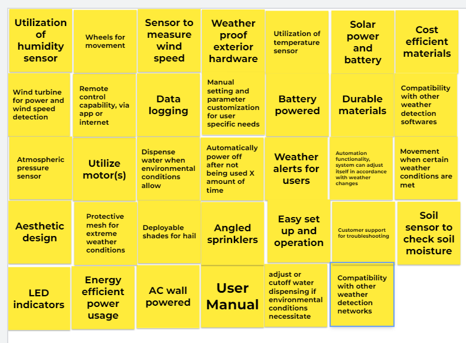
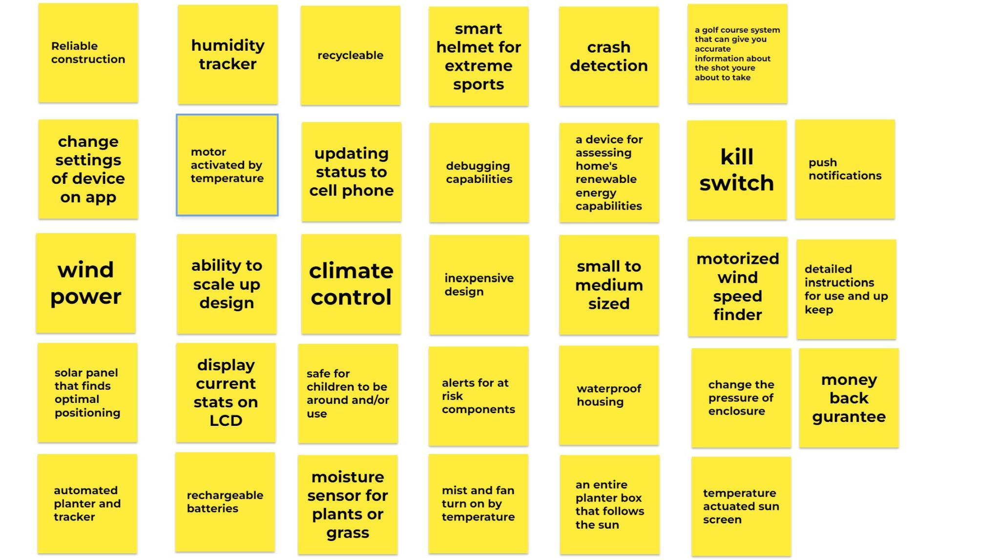
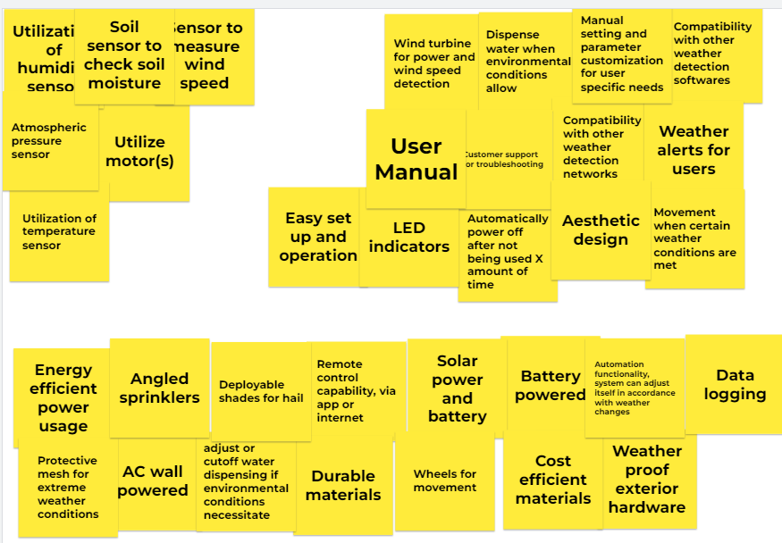
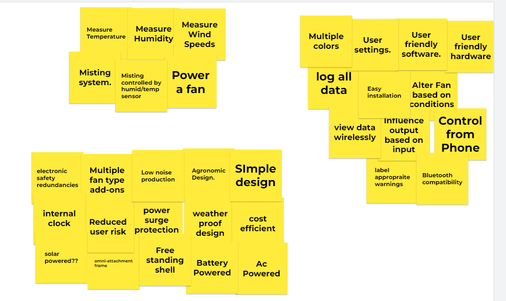
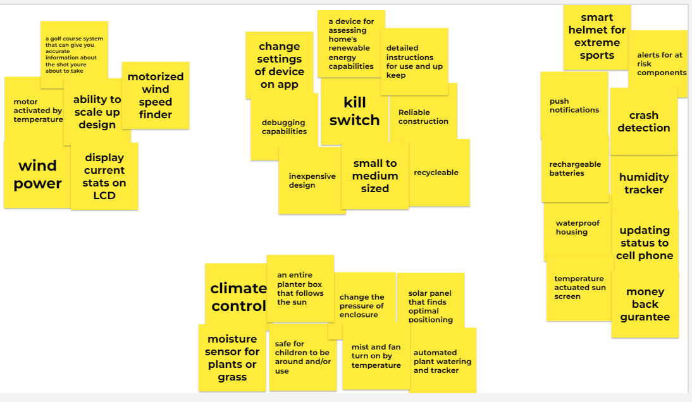
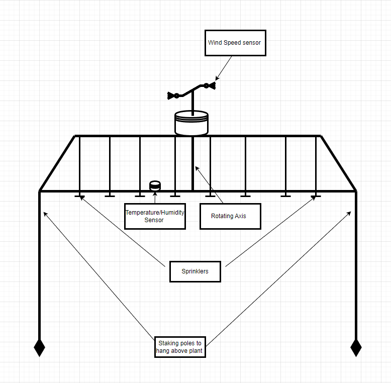
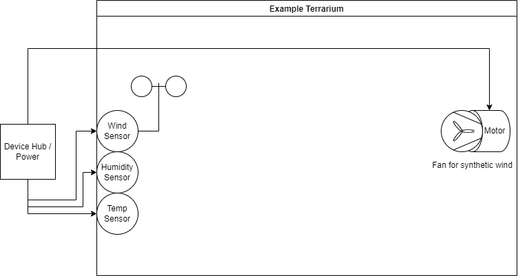
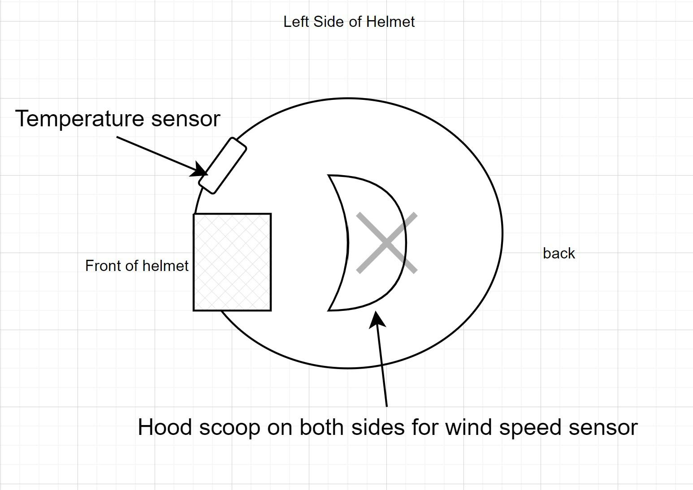

**Design Ideation **

1. Generate Ideas 

In order to fully facilitate our product requirements, we listed every possible need, want,   
hope or requirement into a massive brainstorming pad. These are listed below. 

  

2. Sort, Rank, and Group Design Concepts 

In order to productively figure out which items or points are necessary or required, we sorted each of the notes made above into categories. Combining ideations that were repetitive 

  

In the groupings, we identified that we required 2 sensors (whatever those may be) and motorization. In our want we need our consumers to be satisfied with the product. This can manifest in many ways, from simple addons to complete design changes. Other groups specify ideas that would be standardized to include in the final product, such as surge protectors or LED lights. 

3. Create three product concept sketches (or similar) 

**Concept #1: Outdoor Planter Automated Irrigation Network **  
  

**Concept #2: Reptile Habitat Weather System **  
  

**Concept #3: Smart Outdoor Sport Helmet **  
  
