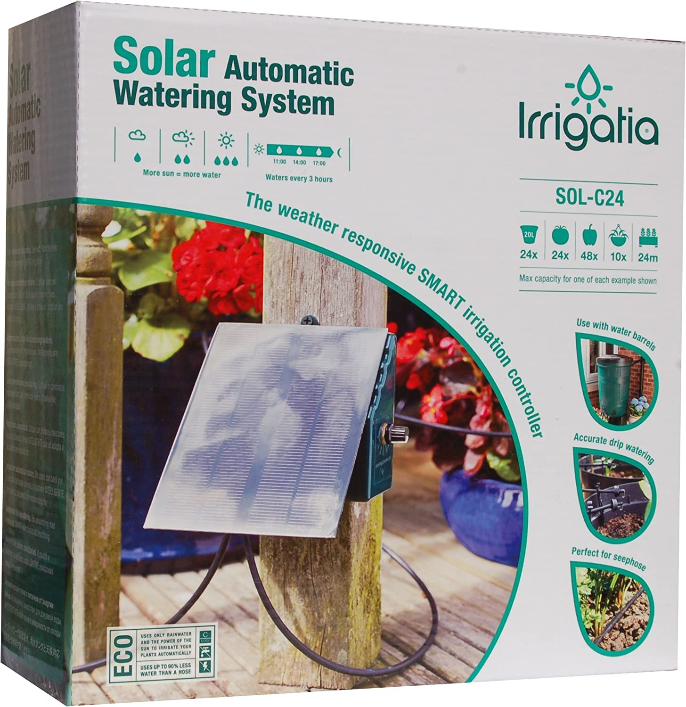
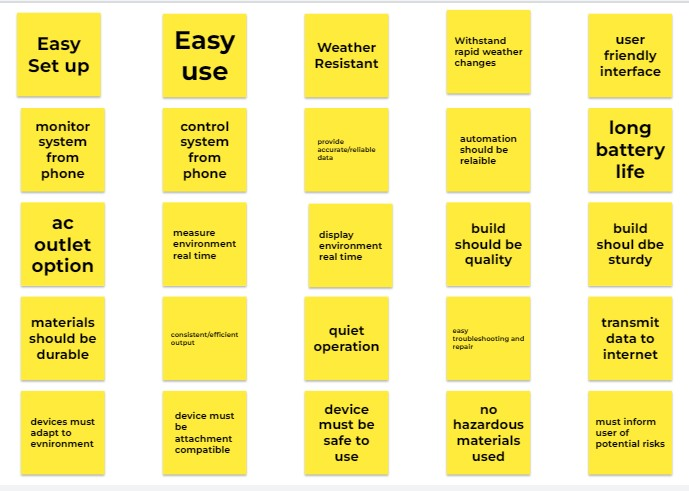
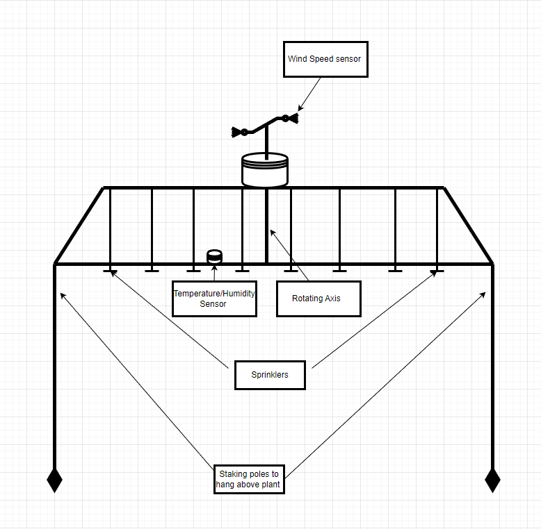

> **<u>User Needs, Benchmarking and Product Requirements</u>**

## User Needs

1.  Easy to set up.

2.  Easy to use.

3.  Weather-resistant design. (wind/rain)

4.  Withstand rapid changes in weather conditions. (cold/hot)

5.  User-friendly interface for easy navigation and monitoring of environmental data.

6.  Ability to monitor the system from a mobile app.

7.  Ability to control the system from a mobile app.

8.  Provide accurate and reliable data.

9.  Automated functions should operate reliably.

10. Long battery life.

11. AC outlet option, to avoid battery.

12. Measure environmental conditions in real time.

13. Display environmental conditions in real time.

14. Build should be quality and sturdy, not easy to break.

15. Materials should be durable and long lasting.

16. Consistent and efficient output .

17. Quiet device operation.

18. Easy troubleshooting and repair.

19. Transmit data to the internet.

20. Devices must be adaptable for different environments.

21. Devices must be compatible with many attachments.

22. The device must be safe to use.

23. The device must not contain hazardous materials.

24. The device must inform the consumer about potential risks.

25. The device must be easy to install.

26. Devices must be compatible with other software.

27. Device presentation must be visually appealing.

28. Device should be compact.

29. Devices must be marketable.

30. Device should fulfill project requirements

31. Must be within dedicated budget

32. Replaceable parts

33. The device should be fairly small

34. Devices must have longevity.

35. Devices must take account of multiple users.

36. Devices must list recording maximums.

37. Devices must list recording minimums.

38. Devices must work according to advertised.

39. Devices must be user friendly.

40. Devices should have replaceable parts.

41. Devices must consistently produce accurate readings.

42. Devices must consistently produce accurate readings even through age/deterioration.

43. A device must be safe not only for the user, but other beings in the area.

44. Must be free of toxic chemicals.

45. Any necessary toxic components must be contained.

46. Devices must withstand extreme conditions.

47. Devices may not degrade over time.

48. The battery life must last fairly long.

49. Shatter resistant.

50. Agronomic design to protect people and other animals.

51. Portability.

52. Radio-wave reduction. May not interfere with other electronics.

53. Affordable for the target market.

54. Ability to integrate with other weather monitoring systems or networks.

55. Alerts or notifications for extreme weather conditions or sensor malfunctions.

56. Low power consumption for extended use without frequent battery replacement or recharging.

57. A feature that allows users to set custom alerts and notifications.

58. A feature to allow multiple users to access the data remotely.

59. ability to program specific tasks or actions based on weather conditions.

60. Data logging and storage capabilities for long-term monitoring and analysis.

## Search \#1

> **Keywords: “Automated irrigation system”**
>
> **Search Results Link:** [<u>automated irrigation system - Google Shopping</u>](https://www.google.com/search?q=automated%2Birrigation%2Bsystem&sa=X&biw=1920&bih=969&tbm=shop&ei=uGrFY4nUMozAkPIPpK2d6As&oq=automated%2Birrigatio&gs_lcp=Cgtwcm9kdWN0cy1jYxADGAAyBQgAEIAEMgcIABCABBAYMgcIABCABBAYMgcIABCABBAYMgcIABCABBAYMgYIABAWEB4yCAgAEBYQHhAYMggIABAWEB4QGDIICAAQFhAeEBgyCggAEBYQHhAKEBg6CAgAEI8BEOoCOgQIABBDOgsIABCABBCxAxCDAToECAAQAzoJCAAQgAQQChAYSgQIQRgAUKYSWJROYKBbaAJwAHgAgAE2iAGiB5IBAjIwmAEAoAEBsAEKwAEB&sclient=products-cc&spd=17438264504673784688)

## Selected Products

1.  [<u>OWSOO Smart Drip Irrigation Kit Automatic Plant Water System for Garden Indoor</u>](https://www.walmart.com/ip/OWSOO-Smart-Drip-Irrigation-Kit-Automatic-Plant-Water-System-for-Garden-Indoor-Plants/529435757?wmlspartner=wlpa&selectedSellerId=101044621) [<u>Plants - Walmart.com</u>](https://www.walmart.com/ip/OWSOO-Smart-Drip-Irrigation-Kit-Automatic-Plant-Water-System-for-Garden-Indoor-Plants/529435757?wmlspartner=wlpa&selectedSellerId=101044621)

- Price \$99.99

- Vendor: Walmart/Amazon

- Description: Automatic Watering Device for Indoor Plants

> **Positive Comments**

<table>
<colgroup>
<col style="width: 50%" />
<col style="width: 50%" />
</colgroup>
<thead>
<tr class="header">
<th>Voice of the Customer</th>
<th>Restated Customer Need</th>
</tr>
</thead>
<tbody>
<tr class="odd">
<td>“I recently purchased this kit for my indoor plants, and I couldn't be happier with my</td>
<td><blockquote>

1. Weather-resistant design that can withstand harsh outdoor conditions-

</blockquote></td>
</tr>
</tbody>
</table>

<table>
<colgroup>
<col style="width: 50%" />
<col style="width: 50%" />
</colgroup>
<thead>
<tr class="header">
<th>purchase. The kit is easy to set up and comes with everything you need to get started. The automatic watering system ensures that my plants are always properly hydrated, and the ability to set specific watering intervals is a huge plus. The kit also has a mobile app that allows you to control and monitor the system from your phone, which is very convenient. The design is sleek and the build quality feels very solid. I especially appreciate the weather resistant features of the kit. The OWSOO Smart Drip Irrigation Kit has been a great addition to my gardening setup and I highly recommend it to anyone looking for an easy and efficient way to water their plants.”</th>
<th><blockquote>

Explicit

2. Automated Function interval option- Explicit

</blockquote></th>
</tr>
</thead>
<tbody>
<tr class="odd">
<td>“I purchased the OWSOO Irrigation Kit for my outdoor garden and it has been a game changer. The automatic watering system has made it so much easier to keep my plants hydrated, especially during the hot summer months. The kit is easy to install and comes with clear instructions. I love being able to control the watering schedule from my phone using the mobile app. The sensors are accurate and the kit is able to sense the humidity, temperature, and atmospheric pressure which gives me a better understanding of the environment my plants are in. The kit is weather resistant and I have not had any issues with it during the rainy days. The build quality is excellent and I highly recommend this product to anyone looking for an efficient and convenient way to water their plants.”</td>
<td><ol type="1">
<li><blockquote>

Provide accurate and reliable data- Latent

</blockquote></li>
<li>
Accurate sensing- Latent
</li>
</ol></td>
</tr>
<tr class="even">
<td>“This is a great purchase. The automatic watering system is convenient, the mobile app is great, and the weather-resistant design is high quality. I highly recommend it”</td>
<td><blockquote>

1. Hands off convenience- Latent

</blockquote></td>
</tr>
</tbody>
</table>

> **Negative Comments**

<table>
<colgroup>
<col style="width: 50%" />
<col style="width: 50%" />
</colgroup>
<thead>
<tr class="header">
<th>“The OWSOO Smart Drip Irrigation Kit was a disappointment. The setup was frustrating, the automatic watering system was unreliable, and the mobile app was difficult to use. I would not recommend this product.”</th>
<th><ol type="1">
<li>
Reliable automation- Explicit
</li>
<li>
User friendly- Latent
</li>
</ol></th>
</tr>
</thead>
<tbody>
<tr class="odd">
<td>“The Smart Drip Irrigation Kit has some good features but overall, I was not completely satisfied with my purchase. The automatic watering system is a great idea but it was not as reliable as I had hoped. The mobile app is</td>
<td><ol type="1">
<li><blockquote>

Ability to monitor and control the system from a mobile app- Explicit

</blockquote></li>
<li>
Build quality must be high- Explicit
</li>
</ol></td>
</tr>
</tbody>
</table>

<table>
<colgroup>
<col style="width: 50%" />
<col style="width: 50%" />
</colgroup>
<thead>
<tr class="header">
<th>user-friendly but it had some connectivity issues. I liked the weather resistant features but the build quality could be improved. On the positive side, the kit is easy to install, and it has sensors for humidity, temperature, and atmospheric pressure. Overall, I would recommend the product with some reservation”</th>
<th></th>
</tr>
</thead>
<tbody>
<tr class="odd">
<td>“I am overall happy with my purchase of my OWSOO for my outdoor garden. The automatic watering system is very convenient and has helped me keep my plants hydrated with ease. The mobile app is user-friendly and allows me to control the watering schedule from anywhere. The sensors are accurate and give me a better understanding of the environment my plants are in. The build quality is excellent and the weather-resistant features are a great addition. One of the things I would like to see improved is the battery life, it could last longer so that it can be used in remote areas. Another complaint is that the kit could have more detailed instructions for setting up, it took me a bit longer than I expected.</td>
<td><ol type="1">
<li><blockquote>

Measure and display environmental conditions in real time- Explicit

</blockquote></li>
<li>
Longer battery life- Explicit
</li>
<li>
Detailed instructions for setting up.
</li>
</ol>
<blockquote>

-Explicit

</blockquote></td>
</tr>
</tbody>
</table>

## Search \#2

2.  [Amazon.com: Bosmere L451 Irrigatia C24 Automatic Watering Irrigation System, Solar](https://www.amazon.com/Bosmere-L451-Irrigatia-Automatic-Watering/dp/B00SY43114?source=ps-sl-shoppingads-lpcontext&ref_=fplfs&smid=AP3VA1GJZM3EQ&th=1) [Powered Plant Waterer : Everything Else](https://www.amazon.com/Bosmere-L451-Irrigatia-Automatic-Watering/dp/B00SY43114?source=ps-sl-shoppingads-lpcontext&ref_=fplfs&smid=AP3VA1GJZM3EQ&th=1)

- Price: \$94.02

- Vendor: Amazon

- Solar Powered Plant Waterer

> **Positive Comments**

<table>
<colgroup>
<col style="width: 50%" />
<col style="width: 50%" />
</colgroup>
<thead>
<tr class="header">
<th>Voice of the Customer</th>
<th>Restated Customer Need</th>
</tr>
</thead>
<tbody>
<tr class="odd">
<td>
“Perfect. Bought this for our rain barrel to irrigate 12 plants in our raised bed. Setup was fairly easy. I had to use the syringe to prime it initially as described in the manual for first start troubleshooting. It is great that it comes as a kit with all necessary pieces. It has worked flawlessly for a few days since. Will update if I have issues. Honestly I bought a refurbished model here because I wasn't so sure it would work based on some bad reviews online.

Looking back through them I'm pretty sure a lot of people are buying them expecting something much different and bigger. If you have something like a rain barrel and a small vegetable garden this is awesome. Look at the recommended number of spouts and distance, I'm pretty sure if you exceed it this won't work well. It is well tuned for what they give you.”
</td>
<td><ol type="1">
<li><blockquote>

Clear usage instructions or suggestions for long term use- Latent

</blockquote></li>
<li>
Easy use and setup- Explicit
</li>
<li>
Easily repaired- Latent
</li>
</ol></td>
</tr>
<tr class="even">
<td>Literally, for the plants. I ran this from our rain barrel to our hanging baskets. We travel quite a bit, so keeping hanging baskets watered and alive is a challenge every year. This thing solves that problem in spades. Honestly, my biggest complaint is that it works TOO well - the watering frequency is determined by how much sun it gets, and in July/August, this gets so much sun that it could probably run half as often without any trouble. So, my advice is, unless you live in the true desert, place this somewhere that only gets half a day of direct sunlight.The only other thing to be aware of is that the pump isn't quiet. It's not terrible, but you can definitely hear it from 10-20 yards away, including inside the house if it's attached to an exterior wall (maybe this would be better if the wall was wood-frame, rather than brick/masonry).</td>
<td><ol type="1">
<li><blockquote>

Device should sense when there is too much of something- Latent

</blockquote></li>
<li>
Should operate quietly- Explicit
</li>
</ol></td>
</tr>
<tr class="odd">
<td>This was exactly what I was looking for. I built a vegetable garden bed on top of a reservoir of water. I ordered the L451 for the larger solar panel. Up here in the Pacific NW, our direct sunlight can be limited at times. So having the larger panel was a plus. This is my first time,. and LOW maintenance is the desired goal for this garden. Having its own watering system, My veggies are going crazy! Neighbors are</td>
<td><ol type="1">
<li><blockquote>

Higher quantity of accessories- Explicit

</blockquote></li>
<li>
Low maintenance, good quality build
</li>
</ol>
<blockquote>

- Explicit

</blockquote></td>
</tr>
</tbody>
</table>

| very impressed. The only drawback to this kit is the lack of drippers. I wish they would have given more. They are proprietary to this kit. I had to add extra drippers via Rain Bird. The Rain Bird is set to use 1/4 tubing. This kit comes with slightly small tubing. 5 or 6mm is my guess. so I had to stretch the tubing some to get it to fit RainBird drippers. (I used a small bolt and nut. -- contact me if you need help with this) over all I have about 20 drippers, and it's supplying enough drip on level "5" to keep my planting bed of soil moist at all times. |     |
|------------------------------------------------------------------------------------------------------------------------------------------------------------------------------------------------------------------------------------------------------------------------------------------------------------------------------------------------------------------------------------------------------------------------------------------------------------------------------------------------------------------------------------------------------------------------------------|-----|

> **Negative Comments**

<table>
<colgroup>
<col style="width: 50%" />
<col style="width: 50%" />
</colgroup>
<thead>
<tr class="header">
<th>
“Terrible. Do not waste $100 on this piece of junk. Did not work. The only thing it did do was to charge the battery. The pump would never activate. Left it on a table outside in the sun for 3 days. It would not even transfer a single drop of water from the rain barrel to a bowl on top of it. There is no way to turn it on manually which is a bad feature. Needed to wait days just to watch it do nothing. The light indicates the battery is fully charged. Thats all it does.

Ordered a replacement. If that does not work I'm building my own with an arduino. I'll post the instructions here so others can avoid this.

Great idea. Too bad it's total garbage”
</th>
<th><ol type="1">
<li><blockquote>

Should be reliable and work as intended- Latent

</blockquote></li>
</ol></th>
</tr>
</thead>
<tbody>
<tr class="odd">
<td>
“I have been trying for more than a month to get it to work. I have relocated it, primed it, lowered it, shortened the hose run, and currently have it set up as one line going into a cup to measure output and get nothing. It flashes per the setting, and at night goes into night mode but never seems to pump water.

When I use the syringe that came with it to prime the pump, or turn it off and on, the pump loudly runs for a few seconds and I get water to come through the lines, but not in normal operations. I am very frustrated. This would be a great product if it would work.”
</td>
<td><ol type="1">
<li>
Should operate quietly- Latent
</li>
<li><blockquote>

Easy to troubleshoot and fix when necessary- Latent

</blockquote></li>
</ol></td>
</tr>
<tr class="even">
<td>We have had several of these units and every single one the pump has failed after 18 months maximum. This one is the exact same, purchased July 2019 emptied and stored over winter in the house (so not subject to frost or similar) and the batteries are charged, but still nothing from the pump unit. Unit is working as tried the spare pump I had bought for the last</td>
<td><ol type="1">
<li><blockquote>

Materials should withstand time and seasons- Latent

</blockquote></li>
<li><blockquote>

Consistent in its performance and output- Latent

</blockquote></li>
</ol></td>
</tr>
</tbody>
</table>

| unit and it worked fine. NOT IMPRESSED BY QUALITY STANDARDS, even though it works great WHEN it works! |     |
|--------------------------------------------------------------------------------------------------------|-----|

## Search \#3

> **Keywords: Reptile Tank Thermometer/Hydrometer Search Results Link:** [<u>Link</u>](https://www.google.com/search?q=reptile%2Btank%2Bthermometer%2Band%2Bhumidity%2Balterer&sxsrf=AJOqlzUl5PXsjSuKXHZmArzDmRVNb2m79g%3A1673976700106&source=lnms&tbm=shop&sa=X&ved=2ahUKEwicxMmUkc_8AhXqIUQIHXmQADEQ_AUoAXoECAEQAw&biw=1366&bih=625&dpr=1)

## Selected Products

> **Zoo Med Digital Combo Reptile Terrarium Thermometer Humidity Gauge**
>
> [<u>www.chewy.com</u>](https://www.chewy.com/zoo-med-digital-combo-reptile/dp/257704?utm_source=google-product&utm_medium=cpc&utm_campaign=18806583589&utm_content=Zoo%20Med&utm_term&gclid=Cj0KCQiAq5meBhCyARIsAJrtdr5yC5xEvmoFD3cTQhkU5Lo53dT49EmnHAP6RnRycaJZ16HVlXXZM_caAsuhEALw_wcB)

- Price: \$12.49

- Vendor: Chewy

- Battery Powered Thermometer/Humidity Gauge

> **Positive Comments**

<table>
<colgroup>
<col style="width: 50%" />
<col style="width: 50%" />
</colgroup>
<thead>
<tr class="header">
<th>Voice of the Customer</th>
<th>Restated Customer Need</th>
</tr>
</thead>
<tbody>
<tr class="odd">
<td>We bought 3 for our rather large terrarium. The dual remote probes help with installation as we can place them exactly where we want to monitor. To test them, we placed all 3 in same spot to test differences. They all consistently gave same results. Have confidence these gauges will help keep your family member safe.</td>
<td><blockquote>

Device was able to be used effectively and easily.

Consistent readings. Animal/user safety.

</blockquote></td>
</tr>
<tr class="even">
<td>I have been trying out different</td>
<td><blockquote>

Value accuracy.

</blockquote></td>
</tr>
</tbody>
</table>

<table>
<colgroup>
<col style="width: 50%" />
<col style="width: 50%" />
</colgroup>
<thead>
<tr class="header">
<th>
thermo-hygrometers for my collection, and this one is by far my favorite next to Pangea's. Very accurate, and the suction cups are strong enough to resist moving, even with my super

dedicated-to-bulldozing-everyting ball pythons!
</th>
<th><blockquote>

Mountability/connections are strong and reliable/easy-to-use.

Safe for animals/users.

</blockquote></th>
</tr>
</thead>
<tbody>
<tr class="odd">
<td>I've compared both the thermometer and the hygrometer to two other brands and it seems on point. What I like better about this one is that both gauges have a moveable probe so that you can measure the exact points that you need to read.</td>
<td><blockquote>

Reliability Ease of use.

Movable probes = more dynamic use.

</blockquote></td>
</tr>
</tbody>
</table>

> **Negative Comments**

<table>
<colgroup>
<col style="width: 50%" />
<col style="width: 50%" />
</colgroup>
<thead>
<tr class="header">
<th>I got it mounted on my snake tank but had to do some work to the tank, took it off and it broke in half. Tried to fix it but the parts were so small it was basically impossible. As long as you don't mess with it, it should work fine.</th>
<th><blockquote>

Not that durable.

Tiny parts = not user friendly. May modify the base tank.

</blockquote></th>
</tr>
</thead>
<tbody>
<tr class="odd">
<td>The thermometer seems to work fine, compared to the temperature gun I have and one other thermometer. HOWEVER the humidity gauge reads 10% humidity to matter what I do. I held the sensor under a light mist from my fogger (not under running or dripping water) and it didn't change the humidity at all. I turned up the fogger. Still, the meter stayed at 10% no matter how high I turned up the fogger. The tank was 1/2 full of fog and mist and STILL the gauge read 10%. That can't be correct. I'm so irritated that I have wasted my money.</td>
<td><blockquote>

Humidity gauge doesn’t work well. Very poor quality.

Device is not usable.

</blockquote></td>
</tr>
<tr class="even">
<td>I don't think the humidity gauge is working correctly. I'll spray his tank really well and it will shoot up to 90%+ but within 1/2 hour its down to 60% and keeps dropping down</td>
<td><blockquote>

Humidity gauge doesn’t work.

Inconsistent readings.

</blockquote></td>
</tr>
</tbody>
</table>

<table>
<colgroup>
<col style="width: 50%" />
<col style="width: 50%" />
</colgroup>
<thead>
<tr class="header">
<th>into the 20's which I don't think is actually possible when leaves etc in the tank are still wet. All the analog ones I've had in the past have never dipped below 50-40%. I think the thermometer is working okay.</th>
<th><blockquote>

Clearly wrong readings.

</blockquote></th>
</tr>
</thead>
<tbody>
</tbody>
</table>

## Search \#4

> **Keywords: Wind Humidity Recorder Search Results Link:[<u>LINK</u>](https://www.google.com/search?q=wind%2Fhumidity%2Bsensor&sa=X&biw=1366&bih=625&tbm=shop&sxsrf=AJOqlzUWVnJm1CHi2TIcq2798h84pI2xEQ%3A1673981004361&ei=TOzGY6CzFavHkPIPqK2m6A0&ved=0ahUKEwigiYCZoc_8AhWrI0QIHaiWCd0Q4dUDCAg&oq=wind%2Fhumidity%2Bsensor&gs_lcp=Cgtwcm9kdWN0cy1jYxAMMggIABCiBBCwAzIICAAQogQQsANKBAhBGAFQAFgAYL9caAFwAHgAgAEAiAEAkgEAmAEAyAECwAEB&sclient=products-cc)**

## Selected Products

> [www.Amazon.com](https://www.amazon.com/Anemometer-Handheld-Detector-Temperature-Windsurfing/dp/B07ZJ38ZMX/ref%3Dasc_df_B07ZJ38ZMX/?tag=hyprod-20&linkCode=df0&hvadid=385240132448&hvpos&hvnetw=g&hvrand=12531046856748284372&hvpone&hvptwo&hvqmt&hvdev=c&hvdvcmdl&hvlocint&hvlocphy=9030013&hvtargid=pla-872827223034&psc=1&tag&ref&adgrpid=80078690338&hvpone&hvptwo&hvadid=385240132448&hvpos&hvnetw=g&hvrand=12531046856748284372&hvqmt&hvdev=c&hvdvcmdl&hvlocint&hvlocphy=9030013&hvtargid=pla-872827223034)

> Digital Wind Speed Meter Anemometer Handheld Wind Gauges Air Flow Velocity Meter for Measuring Wind Chill Temperature Speed, Wind Meter Thermometer Gauge for Shooting Windsurfing Fishing Hunting

- Price: \$ 16.99

- Vendor: Amazon

- Battery Powered Wind and Humidity Recorder/Gauge

> **Positive Comments**

<table>
<colgroup>
<col style="width: 50%" />
<col style="width: 50%" />
</colgroup>
<thead>
<tr class="header">
<th>Voice of the Customer</th>
<th>Restated Customer Need</th>
</tr>
</thead>
<tbody>
<tr class="odd">
<td>
After doing a bunch of tests, it seems to be consistently showing 10% lower than actual wind speed. I measured up to 25mph and down as low as 2mph. But this is a budget item and not a precision instrument, so the value for dollar is pretty good. It's easy to use. Would I buy it again? Yes. Would I use this for some sort of scientific field work?

Probably not, I'd get one that's more accurate. But for sports/recreation where you need to know wind speed and temp, this thing can't be beat.
</td>
<td><blockquote>

Consistent readings.

Slightly inaccurate, but good for cost.

Ease of use.

</blockquote></td>
</tr>
<tr class="even">
<td>It is a nice gadget for the amount of money I paid for it, but both batteries that were included were dead on arrival, had to purchase a new one. Seems accurate on the readings but the air flow needs to be a bit strong to be able to.move the fan, I tried to use my breath to see it it was sensitive enough but no. For the price it is just fine. I will recommend it.</td>
<td><blockquote>

Excellent cost.

Fairly accurate reading.

Minor mishaps with the air flow, but

</blockquote>

. still usable.
</td>
</tr>
<tr class="odd">
<td>pocket size, with temp and wind speed- good to know- many activities are affected by wind and temp</td>
<td><blockquote>

Small size = portable. Batteries = portable.

Good for the size/cost

</blockquote></td>
</tr>
</tbody>
</table>

> **Negative Comments**

<table>
<colgroup>
<col style="width: 50%" />
<col style="width: 50%" />
</colgroup>
<thead>
<tr class="header">
<th>I walked out of our home during the height</th>
<th><blockquote>

Not durable

</blockquote></th>
</tr>
</thead>
<tbody>
</tbody>
</table>

<table>
<colgroup>
<col style="width: 50%" />
<col style="width: 50%" />
</colgroup>
<thead>
<tr class="header">
<th>of Hurricane Ian to check on whether any of our trees had blown down. I took out my wind meter because I thought it would be impressive to watch it read 90+ mph. It read 8 mph. I ordered a more quality device the next day. Don't buy.</th>
<th><blockquote>

Very inaccurate readings.

</blockquote></th>
</tr>
</thead>
<tbody>
<tr class="odd">
<td>I tested this device on a windy day in the northeast. The turbine blades cracked when the wind speed increased dramatically. It's no longer operable.</td>
<td><blockquote>

Not durable Broke quickly.

</blockquote></td>
</tr>
<tr class="even">
<td>Can't believe it did not last a full three months.</td>
<td><blockquote>

Quality is poor

Broke quickly.

</blockquote></td>
</tr>
</tbody>
</table>

## Search \#5

> **Keywords: Wind Speed Measuring Device Search Results Link:** [<u>LINK</u>](https://www.amazon.com/Sainlogic-Professional-WiFi-Weather-Station-with-Outdoor-Sensor-Internet-Wireless-Weather-Station-with-Rain-Gauge-Weather-Forecast-Wind-Gauge-Wunderground/dp/B08LL4PXWM/ref%3Dsxin_15_pa_sp_search_thematic_sspa?content-id=amzn1.sym.14a246c3-7a62-40bf-bdd0-5ac67c2a1913%3Aamzn1.sym.14a246c3-7a62-40bf-bdd0-5ac67c2a1913&crid=4USHZP0M1MMY&cv_ct_cx=wind%2Bspeed%2Bmeasuring%2Bdevice&keywords=wind%2Bspeed%2Bmeasuring%2Bdevice&pd_rd_i=B08LL4PXWM&pd_rd_r=14cdd8f9-22a5-4af0-96f7-ff9ea223fe85&pd_rd_w=P01fx&pd_rd_wg=8H4Xa&pf_rd_p=14a246c3-7a62-40bf-bdd0-5ac67c2a1913&pf_rd_r=S6S0ZV425BHX7MXRC61V&qid=1673987593&sprefix=wind%2Bspeed%2B%2Caps%2C186&sr=1-1-a73d1c8c-2fd2-4f19-aa41-2df022bcb241-spons&psc=1&spLa=ZW5jcnlwdGVkUXVhbGlmaWVyPUEzRVVRUDRVWlk4VUtNJmVuY3J5cHRlZElkPUEwMjU4OTc4M1NaMzI5TkdLR1hHUSZlbmNyeXB0ZWRBZElkPUEwODM5MDU4Q1hWNDlaNkxOQlBKJndpZGdldE5hbWU9c3Bfc2VhcmNoX3RoZW1hdGljJmFjdGlvbj1jbGlja1JlZGlyZWN0JmRvTm90TG9nQ2xpY2s9dHJ1ZQ%3D%3D)

## Selected Products

> **Positive Comments**

<table>
<colgroup>
<col style="width: 50%" />
<col style="width: 50%" />
</colgroup>
<thead>
<tr class="header">
<th>Voice of the Customer</th>
<th>Restated Customer Need</th>
</tr>
</thead>
<tbody>
<tr class="odd">
<td>“The unit has all the Wx info needed for a home unit. The display console is clear and colorful though the most important number (for me), outside temp, is a dull amber. Inside temp is white which is very easy to read, even across the room. I would reverse those two colors. Mounting the outside sensor suite is problematic as it must be</td>
<td><ul>
<li>
Easy to read display - explicit
</li>
<li>
Sturdy Mounting - explicit
</li>
<li><blockquote>

Stress-free software use - latent

</blockquote></li>
</ul></td>
</tr>
</tbody>
</table>

<table>
<colgroup>
<col style="width: 50%" />
<col style="width: 50%" />
</colgroup>
<thead>
<tr class="header">
<th>oriented to the South but the unit does not rotate, per se. The short mast is a proprietary design; round with two flat sides. While this is sturdy it does not rotate. Demos online always show the base just being screwed onto a wooden fence so it can be easily, properly oriented but I needed to mount onto a steel rail. Software setup is a little tedious but it works OK when completed. The firmware update feature did not work. Overall it's a nice unit and I have recommended it to others.”</th>
<th></th>
</tr>
</thead>
<tbody>
<tr class="odd">
<td>“This was a birthday gift to my husband. He loved it. The set up was easy and the read out display was large enough to easily see without having to walk closer to it or wear glasses. Everything was great until the temp gauge stopped working. just the outside temperature. Now we had a hot summer for sure, but the unit was only 5 months old at the time. The manufacturer was contacted and without any hassle a new unit was sent and hubby is back to loving his birthday gift again. So great customer support if you ever need it. I would recommend the product.”</td>
<td><ul>
<li>
Easy Setup - explicit
</li>
<li>
Large display - explicit
</li>
<li><blockquote>

Easily replaceable parts - explicit

</blockquote></li>
<li><blockquote>

Good Customer Support - explicit

</blockquote></li>
</ul></td>
</tr>
<tr class="even">
<td>“ This is an awesome and very easy to use wifi weather station. The 5-in-1 outdoor sensor includes rain funnel, solar panel and transmission module, wind vane and high-speed anemometer, and transmits current information about temperature, humidity, air pressure, wind speed and wind direction, as well as the amount of precipitation and UV radiation and so much more. It is very easy to setup and install. I love the easy to read LCD display which shows you all the information needed. The app also gives much of the same features. It has a wide range of use of to 300 feet. It is very durable and sturdy. Very pleased at the overall price and value. Definitely recommend this weather station.”</td>
<td><ul>
<li>
Easy to read display - explicit
</li>
<li>
Good Price and value - latent
</li>
<li>
Wide Range of Use - latent
</li>
</ul></td>
</tr>
</tbody>
</table>

> **Negative Comments**

<table>
<colgroup>
<col style="width: 50%" />
<col style="width: 50%" />
</colgroup>
<thead>
<tr class="header">
<th>
“I purchased this WiFI enabled unit to view the weather when away from the house. I can do it with cameras, thermostats and more, that is what was advertised. First, you MUST create THREE NEW accounts (WUnderground.com, Weathercloud.net, the Sainlogic phone App).

Second, you have to waste lots of time with each App/login to ADD the new weather station so it can be recognized by each new app. After two weeks of continual zero communications past the Sainlogic app. I boxed it up and returned it. I liked the base unit it appeared good. Our winds are
</th>
<th><ul>
<li><blockquote>

A Single Encompassing App - explicit

</blockquote></li>
<li><blockquote>

More in-depth Instructions - latent

</blockquote></li>
<li><blockquote>

Communication for setup problems - explicit

</blockquote></li>
</ul></th>
</tr>
</thead>
<tbody>
</tbody>
</table>

<table>
<colgroup>
<col style="width: 50%" />
<col style="width: 50%" />
</colgroup>
<thead>
<tr class="header">
<th>20-30 mph, so I don't know how long it would last. The display seemed good after reseting all the functions. But try as I may, I followed the instructions to the letter many times and never connected on my 2400bt router (required) and copied all of the three logins to the app, to no avail. It's not ready for primetime. Returned the while package. Not recommend it for WiFi operation.”</th>
<th></th>
</tr>
</thead>
<tbody>
<tr class="odd">
<td>
“So far I have spent several hours trying to connect to the console Wi-Fi without any success. I have tried the quick set up instructions, the Wi-Fi set up guide, and called Amazon help and they referred me to a YouTube video which was the wrong model and then to another video which was the correct model, however, the narrator stated that his unit (same model number) did not have Wi-Fi.

I will try one more time, then the unit goes back to Amazon.

If Sainlogic is going to produce such a difficult to set up device, the least they could do is provide telephone support to actually get the device to work.”
</td>
<td><ul>
<li>
More Setup Support - explicit
</li>
<li>
More clear Instructions - explicit
</li>
</ul></td>
</tr>
<tr class="even">
<td>“this product is not accurate app shows nothing no customer service no tech support I am wondering why amazon is selling this product.”</td>
<td><ul>
<li>
Accurate Sensing - latent
</li>
<li><blockquote>

More Customer Service - explicit

</blockquote></li>
<li>
More Tech Support - explicit
</li>
</ul></td>
</tr>
</tbody>
</table>

> **Jamboards**
>
> 
>
> **Organize**
>
> 

## Product Requirements

> **Introduction**
>
> Weather is an aspect of the world that remains uncontrolled which oftentimes may impede on everyday activities or special events. This problem leaves room for technological solutions to accommodate unexpected weather patterns in varying situations. That being said, there is a large market for products that have weather sensing capabilities which can in turn help users utilize these devices to adapt their systems to different weather conditions, whatever the case may be. However, not all solutions have been explored leaving room for a new solution to be developed, employing serial sensors, actuation functionality, remote control via internet or app and a Microchip microcontroller.

## Objectives

> Our main objectives are to design and develop a mobile weather station that can respond to the environment using serial sensing and actuation to sense at least two of the following environmental conditions: temperature, humidity, atmospheric pressure, wind speed. Also to include at least one motor controlled by a motor controller that communicates over the I2C or SPI-based protocol and data will be broadcasted to the internet over WiFi using the MQTT protocol for real-time monitoring and analysis. All while the design and functionality satisfies the user and stakeholder needs gathered in earlier research.

## Stakeholders

> **Target Group:** Any person looking to use our device to fit their needs when it comes to weather detection and interaction.
>
> **Target Purchaser**: Any person or group who aims to get base measurements of weather, and record noticeable changes.
>
> **Customer Service:** Contact production company
>
> **Retailers**: Online and in store retailers( Amazon, Walmart, adafruit)

## Use Cases

> **User Story \#1:** Jack and Jill want to find and document the weather for a full year to find out the optimal time for their vegetables to grow. They decide to invest in an
>
> at-home weather station to track the temperature and humidity in their immediate location as accurately as possible. With the use of their newfound data, they can plant their produce at the perfect time for a healthy and plentiful season.
>
> **User Story \#2:** Jill wants to keep track of how healthy her plants are and decides to add a solar powered automatic watering device to her planter. This device will detect if her plants have too much or too little water and will add the correct amount accordingly. All of the data can be tracked on her phone so that she knows her plants are getting the correct care.

## Aspects

1.  **Product Design**

    1.  Design will optimize space to acquire a sleek and compact size

    2.  Design will be able to withstand harsh outdoor conditions and be weather-resistant

    3.  Must be cost efficient for the consumer.

    4.  Must be compact for portability.

2.  **Functionality/ Software**

    1.  Mobile app control, allow the user to adjust settings and monitor the system remotely via a mobile app or internet connection

    2.  System will utilize a variety of sensors to monitor environmental conditions such as temperature, humidity, wind speed, etc

    3.  Data will be transmitted to internet

    4.  Physical displays of the data recorded (gauge)

3.  **Interactivity/ User experience**

    1.  Device setup should be easy and include detailed instructions

    2.  Usage of device and interface should be straight forward

    3.  Maintenance should be basic or non existent

    4.  Clear and easy instructions for repair or operation.

<!-- -->

4.  **Customization**

    1.  The user should be able to adjust the sensitivity of the environmental sensors to match their specific needs

    2.  The user should be able to modify the displayed outputs to visualize the data they need.

    3.  The user must be able to connect it to multiple power inputs. (USB/AC)

    4.  The user would be able to modify the components as needed, i.e; replacement parts, new case, etc.

5.  **Manufacturing**

    1.  Should be designed to be recycled or reused

    2.  Materials should be cost efficient without compromising quality

    3.  Material will be durable and have longevity

    4.  Quality materials must be used when necessary.

6.  **Safety**

    1.  The overall product must be designed in a way that avoids risk to the user.

    2.  Exclusion/reduction of materials that are potentially hazardous.

    3.  Space for any warning labels/details.

    4.  Instructions on how to operate safely.
