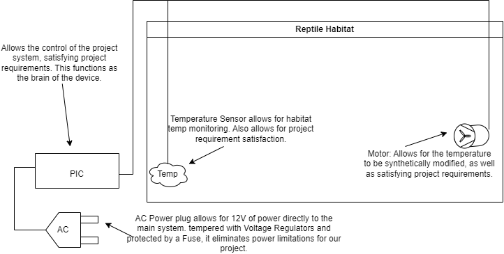

# Information

EGR314 Spring 2023  
Professor Aukes  
Team 204  
Members:  
Nicholas C. Dunn  
Eduardo Lopez  
Richard Green

# Table of Contents
* [Introduction](https://egr314-team204.github.io/#introduction-team-204-semester-project)
* [Team Organization](https://egr314-team204.github.io/#team-organization)
* [User Needs, Benchmarking and Requirements](https://egr314-team204.github.io/#user-needs-benchmarking-and-requirements)
* [Design Ideation](https://egr314-team204.github.io/#design-ideation)
* [Presentation](https://egr314-team204.github.io/#presentation)
* [Selecting Our Design](https://egr314-team204.github.io/#selecting-our-design)
* [Block Diagram](https://egr314-team204.github.io/#block-diagram)
* [Component and Microcontroller Selection](https://egr314-team204.github.io/#component-and-microcontroller-selection)
* [Software and Hardware Proposal](https://egr314-team204.github.io/#hardware-and-software-proposal)

## Introduction: Team 204 Semester Project
Add an introduction
Consider moving and updating the introduction from your product requirements document to the front of the report

## Team Organization
 Need to add:  
 Don't simply copy and paste the content from your original assignment; you need to claim ownership of your material by adding context. Convert this assignment into a report format by adding "connective tissue", that explains how you agreed on a project charter and mission statement rather than just pasting them in.  
Add the remaining sections from your assignment to a new appendix page in the back, titled "Appendix A: Team Organization".  
The Team Organization Page and associated appendix should each be separate subpages linked from the top-level page on your site.  
* [Link to Team Organization Page](/TeamOrg)

## User Needs, Benchmarking, and Requirements
Need to add:  
For example, how did your team organize, combine, and split needs into the list you arrived at? Justify the process by which your team assigned weights for importance, using both interview notes and internal team discussions.  
Discuss the process by which your team converted user needs into specifications.  
Discuss, with detail, how your design will be assessed according to the "aspects", to ensure your product meets your requirements. 
* [Link to User Needs, Benchmarking, and Requirements Page](/UserNeed)
  
  
## Design Ideation
When designing our project, we needed to take into consideration many more ideas than the required project parameters. For instance, the product would be worthless if it caused harm to the user. With this in mind, we proceeded to create Jamboards. Jamboards are an online version of a wall of sticky notes, a place where we throw every conceivable point, idea, requirement and thought onto a page.  
  
After doing this, our team member Richie went through the hundreds of notes and compiled them together. Removing repeated statements and combining very similar ones, he reduced the absurd number of notes into a manageable amount.  
  
Once Richie was done with compiling, it was Eddie’s turn to work. He sorted through each of the notes and stacked them based on a subject that each needed to go with. An example of this would be when he put anything to do with safety in the pile labeled “safety”.  
  
When Eddie was finished, Nick went through and ranked each pile depending on how prevalent, necessary or required it was. Needless to say, project requirements and safety of the user/maker were among the highest ranked.  
  
After we had finished this process, we each generated our own concepts. Richie made a weather system helmet, Eddie thought of an irrigation system, and Nick created a reptile habitat monitoring system. Through a few hours of discussion, we decided to go with the reptile habitat, as it seemed to be the most feasible of the ideas generated for us to work on.  
  
* [Link to Ideation Page](/Ideation)

## Presentation
 
* [External Link here](https://www.youtube.com/watch?v=ebKb8as0qI8)
  
# Our Design

## Selecting Our Design
Provide a figure/rendering of your product in its current form. Highlight features that satisfy user needs, with labels and arrows. You may update or re-work one of the images from design ideation, or start from scratch if you prefer.

## Block Diagram
Provide an up-to-date, high quality rendering of your team's block diagram  
  
With a team of 3 members, our project requirements were reduced to a single motor subsystem, a single weather related sensor, and the primary microcontroller. Each member took a subsystem, and constant communication between us has been crucial in deciding steps for each.  
  
Richie took the temperature sensor. This satisfies the project requirements as it will be able to detect changes in the outside world, and then relay changing data to the microcontroller to be displayed.  
  
Eddie has the hardest subsystem of all: the microcontroller. This is the primary brain of our device and is essential for the other 2 subsystems to work. It will read the data produced by the above sensor and display it.  
  
Nick defaulted to the final available subsystem, the motor. In order to satisfy project requirements a motor controller was needed to control it. This communicates with the microcontroller, and will change it’s speed depending on the variables received from the temperature sensor through the microcontroller.
  
  
## Component and Microcontroller Selection
Include your component selection section / page.  
Highlight (and only discuss) the selected components, not the unselected alternatives.  
Be prepared to discuss your power budget  
* [Link to Component Selection](/ComponentSelect)

Include your microcontroller selection assignment.  
Be prepared to discuss your selected microcontroller, and the rationale for selecting it over the alternatives, based on your design requirements.  

* [Link to Microcontroller Selection](/MicroSelect)

## Hardware and Software Proposal
Update your project report on your team website to include a high-quality, crisp (not blurry) rendering of your full project schematic(s). Do not use a screenshot.  
Be prepared to discuss your schematic and Bill of Materials  
* Link to Hardware Proposal

Include your software proposal section / page, including a high-quality, crisp (not blurry) copy of your activity diagram(s) or state diagram(s), MCC configuration, and function declarations.  
Be prepared to discuss your UML Diagram 1.  
* [Link to Software Proposal](/Software)

# Other website format resources
  
## Background

![image caption]

[link to background](/background)

## Results

1. Numbered Point 1
1. Numbered Point 2
1. Numbered Point 3

## Conclusions and Future Work

## External Links

* [example link to idealab](https://idealab.asu.edu)

## References
